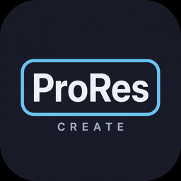
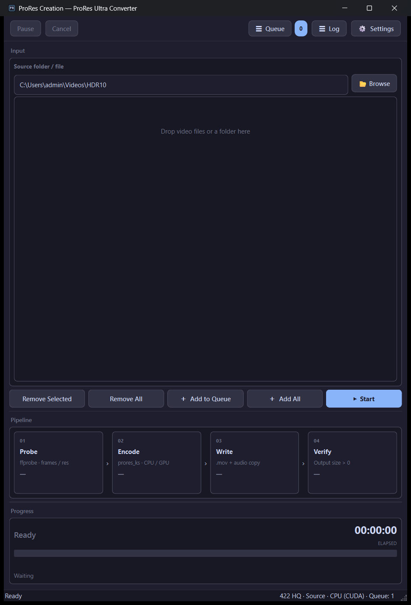
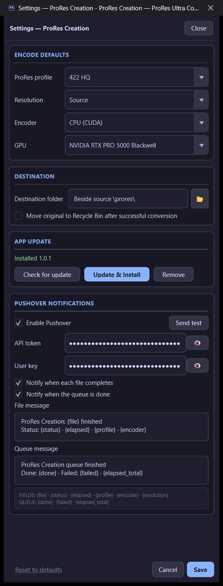

# ProRes Creation

  

  
  
  
  

---

## What is ProRes Creation? (plain English)

**ProRes Creation turns ordinary video files into Apple ProRes `.mov` files** — the editing-friendly intermediate format used in Premiere, Resolve, Final Cut, and many broadcast pipelines.

You drop files in, pick a profile (default **422 HQ**), click **Start**. The app probes the source, encodes ProRes, copies audio into a `.mov`, and verifies the output isn’t empty. Finished files land in a `\prores\` folder next to your source.

No fancy AI — just a reliable batch converter with a queue, log, and optional Pushover “done” pings.

### What happens to each file

| Step | In plain words |
|------|----------------|
| **1 · Probe** | Read frames / resolution with ffprobe. |
| **2 · Encode** | Write ProRes (`prores_ks`) on CPU or GPU path. |
| **3 · Write** | Package `.mov` and copy audio. |
| **4 · Verify** | Confirm output size &gt; 0. |

### Profiles (quick guide)

| Profile | When to use |
|---------|-------------|
| **422 HQ** (default) | Everyday mastering / edit mezzanine |
| **4444 / 4444 XQ** | Highest quality / alpha / 4:4:4 sources |
| **422 / 422 LT** | Smaller files, still ProRes |
| **422 Proxy** | Offline / draft editing |
| **RAW** | Max retention (XQ-class params) |

---

## Screenshots

  

<em>Main window — drop files, Probe → Encode → Write → Verify.</em>

  

<em>Settings — profile, resolution, encoder/GPU, destination, App update, Pushover.</em>

---

## How to use (quick start)

1. Install from [Releases](https://github.com/aberthil/ProResCreate-releases/releases/latest) and open **ProRes Creation**.  
2. **Browse** or **drag-and-drop** videos / a folder.  
3. Optional: **Settings** → ProRes profile (default **422 HQ**) and destination.  
4. **+ Add to Queue** → **Start**.  
5. Open the `\prores\` folder beside your source when it finishes.

---

## Download

| | |
|--|--|
| **Latest Setup** | [ProResCreate-1.0.1-Setup.exe](https://github.com/aberthil/ProResCreate-releases/releases/latest/download/ProResCreate-1.0.1-Setup.exe) |
| **All versions** | [Releases](https://github.com/aberthil/ProResCreate-releases/releases) |
| **SHA-256** | [ProResCreate-1.0.1-Setup.exe.sha256](https://github.com/aberthil/ProResCreate-releases/releases/latest/download/ProResCreate-1.0.1-Setup.exe.sha256) |

> Prefer the **latest** tag always:  
> https://github.com/aberthil/ProResCreate-releases/releases/latest

Installs to `C:\DolbyVisionScripts\ProResCreate` by default. Settings / Pushover / queue live in AppData and **survive App Update**.

---

## Requirements

| | |
|--|--|
| OS | Windows 10/11 **x64** |
| CPU / GPU | CPU encode works everywhere; GPU path when available |
| Disk | ProRes is **large** — plan several× source size for HQ/XQ |

---

## What's New

### v1.0.1

See [Releases](https://github.com/aberthil/ProResCreate-releases/releases) for each Setup’s notes.

---

## Links

- **Latest download:** https://github.com/aberthil/ProResCreate-releases/releases/latest  
- **This repo:** public Setup hosting + project page (source stays private)

---

## License / support

Windows installers for end users. Problems with a specific Setup: note the release tag and contact the publisher (`aberthil`).
